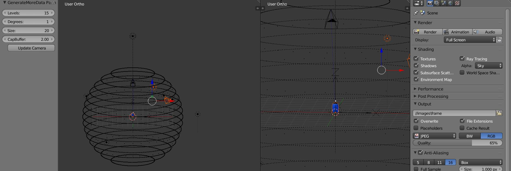
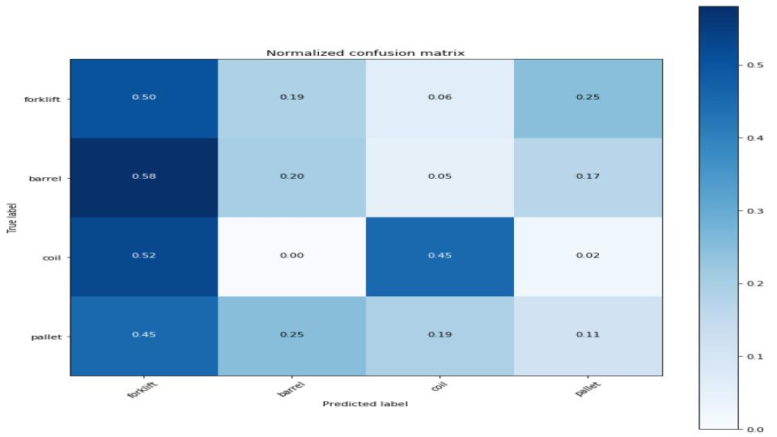
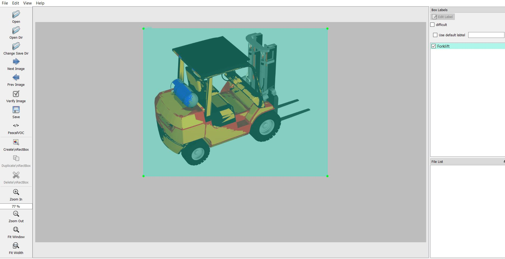

# This repository is for Team Project Deep learning with simulation

In order to access all the files clone this repository.

## There are three main steps in this project. 
step 1: Generation of simulated data (Virtual Data).  
step 2: Testing of virtual data.  
step 3: Using Inception v2 Algorithm.  

## Step 1 : Generation of simulated data(virtual data)
### Prerequisites 
[Blender - Install blender by clicking this](https://www.blender.org/download/).  
Clone this repository you have all the files needed for this step under the folder Python_code_for_rendering and blender_files.  
### Procedure:
Run the blender application, change the mode to scripting form the above panel on the top. Then import the file generate more data panel and execute it.  
If there are any problems in running the script we made a blend file in which the generate more data panel is preloaded. Just open the file ‘generateMoreData.blende’. Navigate to file -> append and Navigate to blender_files in the explorer and select the model(which is in the format of .blend file), you get to see more options navigate to object and select all the files and click ‘Append from library’ then you get your model imported in blender. Run the script by clicking ‘Reload Trusted’  you need to see something like in the image.  
folder
  
<p align="center">
  
</p>
  
You can play with the settings form the GenerateMoreData pannel(I know, I am bad at giving names) after your desired settings just click ‘Animation’ form the panel to the right side.(Do not forget to change the resolution and folder path to save the image files code automatically creates a floder in the path).  

## Step 2: Testing of virtual data(Simulated data).
### 2a.Installing requirements
Download the [Anaconda](https://www.anaconda.com/distribution/) along with desired python version. In this project, we will be using windows, conda version 4.6, python 3.6.  
After installing anaconda, open Anaconda Prompt as Administrator and create a new virtual environment by copying following command. 

```
conda create -n env  pip python=3.6
```
Then activate the newely created enviroment.  
```
(base) C:\Windows\system32>conda activate env
(env) C:\Windows\system32>
```

Install tensorflow in this environment by issuing:  

```
(env) C:\Windows\system32> pip install --ignore-installed --upgrade tensorflow
```
If you want to use GPU version of the tensorflow you can follow instructions in this [youtube video](https://www.youtube.com/watch?v=59duINoc8GM). 

Install the other necessary packages by issuing the following commands:
```
(env) C:\> conda install spyder
(env) C:\> pip install matplotlib
(env) C:\> pip install pandas
(env) C:\> conda install -c anaconda scikit-learn
(env) C:\> pip install lxml
(env) C:\> pip install Cython
(env) C:\> pip install opencv-python
```

Now all the necessary installations are finished open spyder simply by typing and press enter  

```
(env) C:\> spyder
```

Now spyder should be up and running.  
If you have any errors installing you can use copy of my virtual enviroment simply by naviating to installation folder
```
(env) C:\Users\aravi\Desktop\team-project-deep-learning-with-simulation\installation> pip install -r requirements.txt
```

### 2b. Running the scripts

From spyder navigate to CNN_Models and open 01CNN.py and run it (Don't forget to change the path location).  
Test 1: Use test 1 data from Dropbox, This is different sets of virtual data in for training and validating the model with 6 classes.  
Test 2: Use test 2 data, This is train with virtual data and testing with 6 classes.  
Test 3: Use test 2 data, This is train with virtual data and testing with 4 classes (Coil, Barrel, forklift, Pallet).  

use the 02CNN.py for remaining tests  
Test 4: Use test 2 data, This is train with virtual data and testing with 4 classes (Coil, Barrel, forklift, Pallet).  
This model generates a confusion matrix.

<p align="center">
  
</p>

you can download database of actual [images](https://drive.google.com/drive/u/0/folders/1UosDxgtYeyWa2ZRiTq9JWH4FvXg_3WKk).  

## Step 3: Using Inception v2 Algorithm

Copy the tensorflow1 folder from the CNN_Models folder and past in c: of your pc.You need make new virtual enviroment to run this application.  

### 3a. Set up new Anaconda virtual environment

In Anaconda Prompt, create a new virtual environment called “tensorflow1” by issuing the following command:
```
C:\> conda create -n tensorflow1 pip python=3.5
```
Then, activate the environment by issuing:
```
C:\> activate tensorflow1
```
Install tensorflow-gpu in this environment by issuing:
```
(tensorflow1) C:\> pip install --ignore-installed --upgrade tensorflow-gpu
```
Install the other necessary packages by issuing the following commands:
```
(tensorflow1) C:\> conda install -c anaconda protobuf
(tensorflow1) C:\> pip install pillow
(tensorflow1) C:\> pip install lxml
(tensorflow1) C:\> pip install Cython
(tensorflow1) C:\> pip install jupyter
(tensorflow1) C:\> pip install matplotlib
(tensorflow1) C:\> pip install pandas
(tensorflow1) C:\> pip install opencv-python
```
(Note: The ‘pandas’ and ‘opencv-python’ packages are not needed by TensorFlow, but they are used in the Python scripts to generate TFRecords and to work with images, videos, and webcam feeds.).  

### 3b. Configure PYTHONPATH environment variable and run setup
A PYTHONPATH variable must be created that points to the \models, \models\research, and \models\research\slim directories. Do this by issuing the following commands (from any directory):
```
(tensorflow1) C:\> set PYTHONPATH=C:\tensorflow1\models;C:\tensorflow1\models\research;C:\tensorflow1\models\research\slim
```
(Note: Every time the "tensorflow1" virtual environment is exited, the PYTHONPATH variable is reset and needs to be set up again.)  

Run the following commands from the C:\tensorflow1\models\research directory:
```
(tensorflow1) C:\tensorflow1\models\research> python setup.py build
(tensorflow1) C:\tensorflow1\models\research> python setup.py install
```

#### 3c.Labeling and run the traning set

For labeling we used the [tool](https://github.com/tzutalin/labelImg). Labeling is done just by runnig the python code.

<p align="center">
  
</p>

From the \object_detection directory, issue the following command to begin training:  

```
python train.py --logtostderr --train_dir=training/ --pipeline_config_path=training/faster_rcnn_inception_v2_pets.config
```
If everything has been set up correctly, TensorFlow will initialize the training. The initialization can take up to 30 seconds before the actual training begins. When training begins, it will look like this:

<p align="center">
  
</p>

